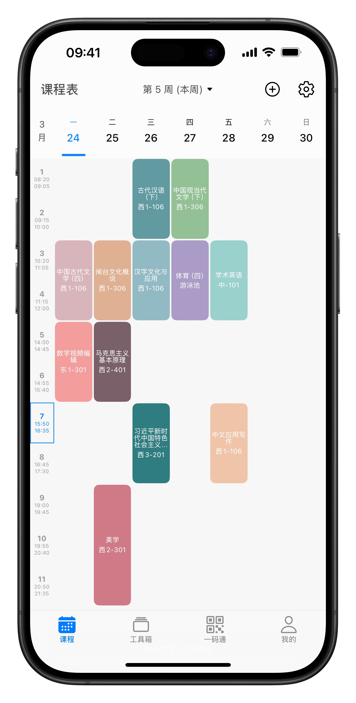
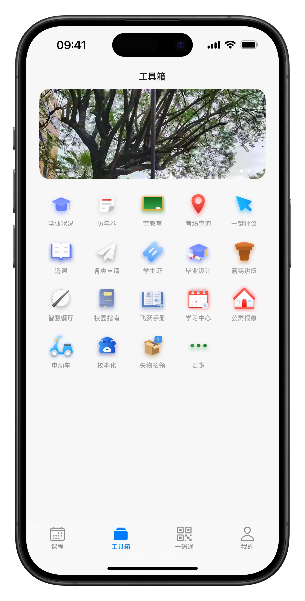
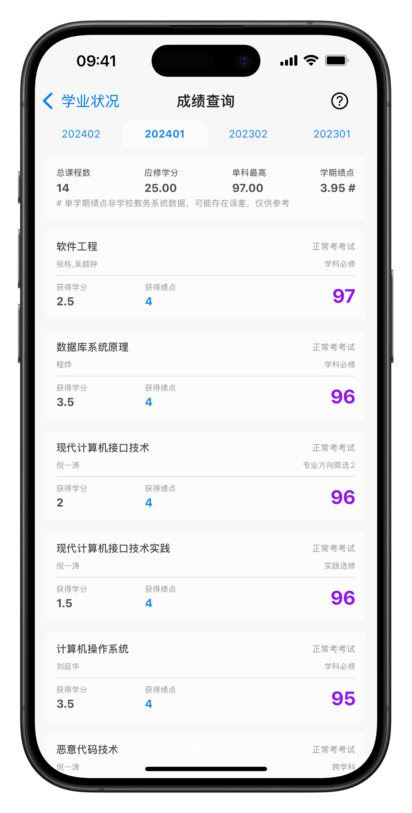
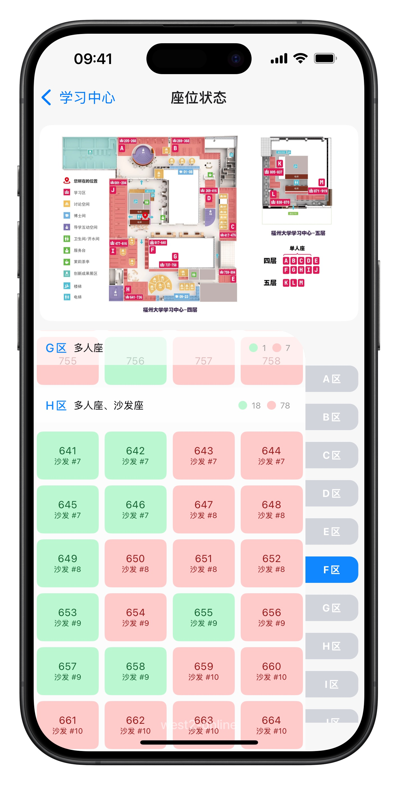
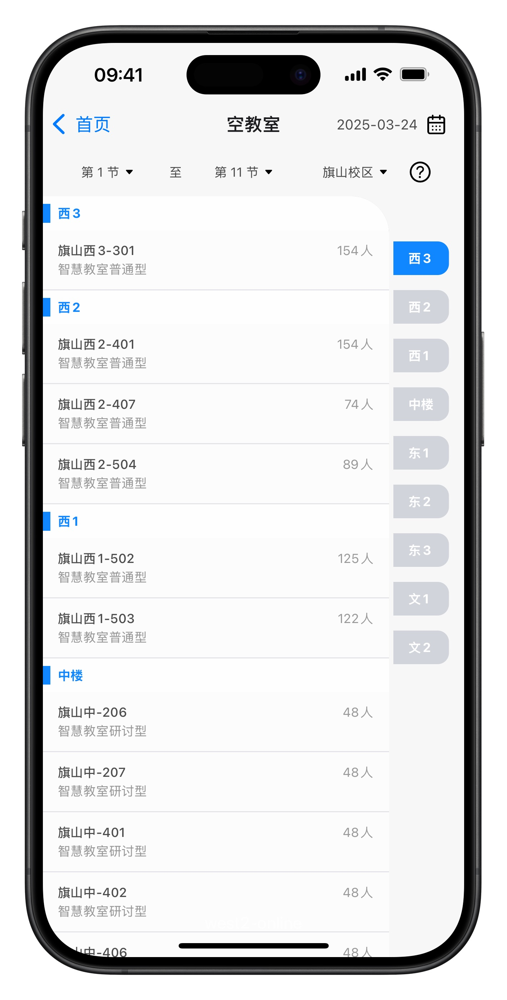
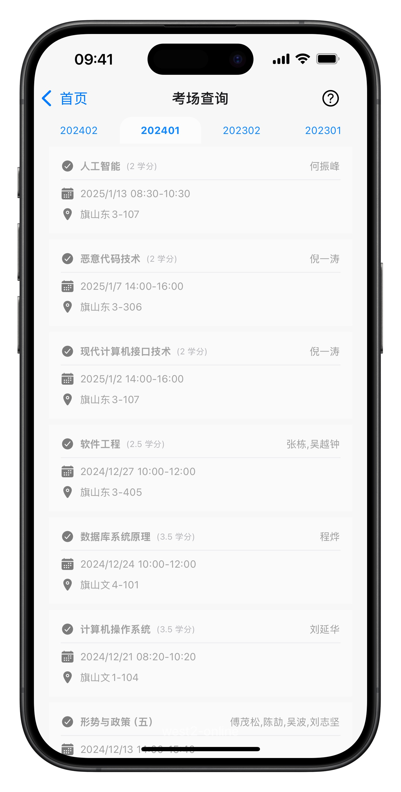
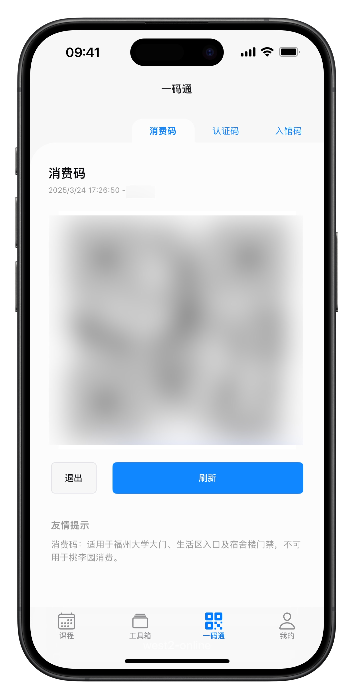
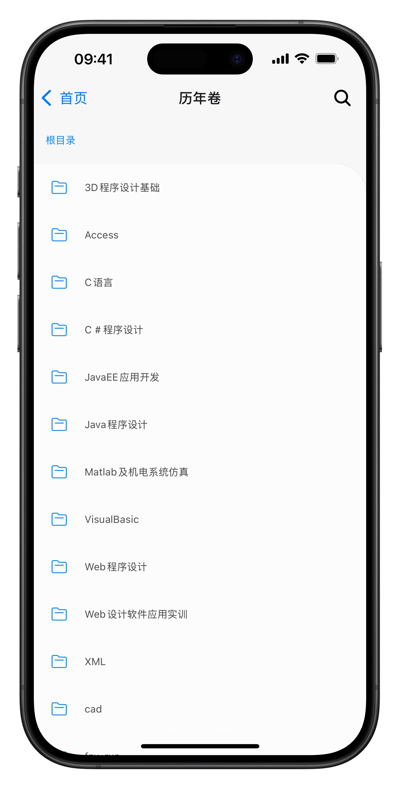

<div align="center">
  
  <h1 style="display: inline-block; vertical-align: middle;">fzuhelper-app</h1>
</div>

## 概述

fzuhelper-app 是一个使用 React Native 跨平台技术开发的客户端应用，每天为福州大学超 3 万名学生提供服务<sup>（[福uu数据来源与介绍](https://west2-online.feishu.cn/wiki/RG3UwWGqPig8lHk0mYsccKWRnrd)）</sup>。

> 福uu 于 2015 年上线，由福州大学西二在线工作室从零开始开发并持续运营，为校内学生提供工业级软件开发实践平台。

<details>
<summary><b>App 预览图 <small>[点击展开]</small></b></summary>
<div style="display: flex; overflow-x: auto;">
  
  
  
  
  
  
  
  
</div>
</details>

## 快速开始

本项目使用 React Native。

在启动开发环境之前，需要准备一台安装了 Windows 10 或更高版本的 PC，或者运行 macOS 15 或更高版本的 Mac。还需要安装好 [Node.js](https://nodejs.org) 和 [Yarn](https://yarnpkg.com)。如果需要进行 iOS 开发，则必须使用 Mac 电脑。

### Android

在开始之前，请确保配置好以下环境：

1. [Android Studio](https://developer.android.com/studio) 和 Android SDK（版本为 36，可以通过 Android Studio 安装）
2. OpenJDK 17
   - 在 Windows 上可以 [使用 winget 安装](https://learn.microsoft.com/en-us/java/openjdk/install?tabs=winget%2Chomebrew%2Cubuntu#install-on-windows)，执行 `winget install Microsoft.OpenJDK.17` 即可。
   - 在 macOS 上可以使用 Homebrew 安装，执行 `brew install openjdk@17` 即可。
3. Android Studio Emulator，可以参考 [Expo 文档](https://docs.expo.dev/get-started/set-up-your-environment/?platform=android&device=simulated&mode=development-build&buildEnv=local#set-up-an-emulator) 中的说明进行设置。

> [!TIP]
>
> <small>为了方便，可以设置环境变量 `APP_VARIANT=development`。这一步是可选的。这将使用与发布版本不同的应用标识符，从而允许开发版和发布版共存。如果未设置环境变量或设置了其他值，则仅使用应用的发布版本标识符。</small>

克隆仓库并安装依赖：

```bash
git clone https://github.com/west2-online/fzuhelper-app.git
cd fzuhelper-app
yarn install
```

预构建 Android 工程项目：

```bash
yarn prebuild:android
```

启动应用：

```bash
yarn android
```

这将启动 Android 模拟器并在开发模式下运行应用。

### iOS

需要安装最新 [App Store 版 Xcode](https://apps.apple.com/us/app/xcode/id497799835) 和 [CocoaPods](https://cocoapods.org/)。

在终端中按照以下步骤操作：

```bash
# 安装 Xcode 命令行工具
xcode-select --install

# 克隆仓库
git clone https://github.com/west2-online/fzuhelper-app

# 安装依赖包
yarn install

# 预构建 iOS 工程项目
yarn prebuild:ios
npx pod-install

# 在模拟器中运行开发版本
yarn ios
# 或（可选）在真机上运行
yarn ios --device
```

## HarmonyOS NEXT

需要先安装 [DevEco Studio](https://developer.huawei.com/consumer/cn/deveco-studio/) 和 [Command Line Tools](https://developer.huawei.com/consumer/cn/download/)，并手动配置好 SDK、模拟器、相关 PATH（Command Line Tools 的 bin；DevEco Studio 的 OpenHarmony SDK Toolchains）。

```bash
# 克隆仓库
git clone https://github.com/west2-online/fzuhelper-app

# 安装依赖包
yarn install

# 预构建 HarmonyOS 工程项目
yarn prebuild:harmony

# 安装 ohpm 依赖
yarn oh:install

# 启动 Expo dev server
yarn oh

# 转发端口（需要先启动模拟器）
yarn oh:forward
```

然后在 DevEco Studio 中打开生成的 `harmony/` 目录，运行 `entry` 模块。

## 参与贡献


如果您有兴趣加入 fzuhelper-app 的维护工作，请通过我们的 [官网](https://site.west2.online) 联系我们。

> [!WARNING]
>
> <small>本项目受福州大学统一指导，由福州大学计算机与大数据学院、福州大学网络安全与信息化办公室管理（以上单位合称「官方」）。本项目源代码使用宽松开源协议，但仅供学习参考，不允许直接或间接性使用/修改后使用在任何非官方和西二在线外的应用、网站、App 及任何可以与用户产生交互的互联网信息媒介中。本警告具备行政约束效力。</small>
