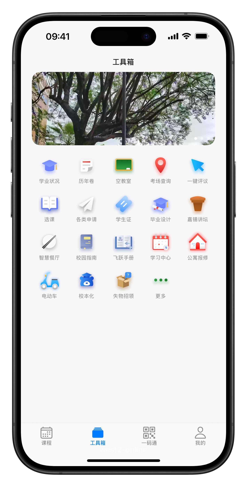
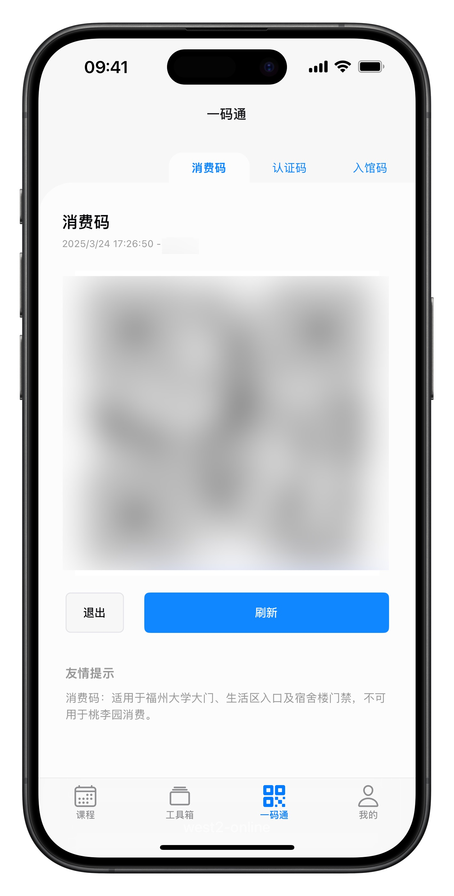

> WARNING(Chinese only): 本项目受福州大学统一指导，由福州大学计算机与大数据学院、福州大学网络安全与信息化办公室管理（以上单位合称"官方"）。这份源代码使用了宽松开源协议，但源码仅供学习参考，不允许该项目直接或间接性使用/修改后使用在任何非官方和 west2-online 外的应用、网站、app 及任何可以与用户产生交互的互联网信息媒介中。该警告具备行政约束效力。

<div align="center">
  <h1 style="display: inline-block; vertical-align: middle;">fzuhelper-app</h1>
</div>

<div align="center">
  <a href="#overview">English</a> | <a href="docs/README.zh.md">中文</a>
</div>

## Overview

fzuhelper-app is a client app that uses React Native cross-end technology. It supports about 20,000 to 30,000 students at Fuzhou University every day. ([Data source and introduction to fzuhelper](https://west2-online.feishu.cn/wiki/RG3UwWGqPig8lHk0mYsccKWRnrd)).

> fzuhelper was launched in 2015, developed from scratch by west2-online and continuously operated, providing students with industrial-grade practice as much as possible on campus and offering robust support for student employment.

<details>
<summary><b>App Previews [click to expand]</b></summary>
<div style="display: flex; overflow-x: auto;">
  
  
  
  
  
  
  
  
</div>
</details>

## Quick Start

This project based on the [Node.js](https://nodejs.org/), [Yarn](https://yarnpkg.com/), make sure to install these software first. It is recommended to use nvm to manage the node version. This project supports running under node v22.

### iOS

> You need at least **a computer with macOS installed**. Recommended configuration: MacBook Pro 2021 or later, 32G memory and equipped with M1/M2/M3/M4 Pro/Max/Ultra

Before start, make sure you have installed [Xcode from App Store](https://apps.apple.com/us/app/xcode/id497799835) and [CocoaPods](https://cocoapods.org/), all use latest version.

Then follow the steps below in Terminal (iTerm2 is recommended):

```bash
# install Xcode commnd line tools
xcode-select --install

# clone repo
git clone https://github.com/west2-online/fzuhelper-app

# install package
yarn install

# prebuild iOS engineering projects
yarn prebuild:ios --clean

# running the dev version on the simulator
yarn ios

# (options) if you need to run on the real device
yarn ios --device
```

**NOTE: You DO NOT NEED to open Xcode for developer unless you are responsible for native related development**, for business implementation, you can develop in vscode throughout the process

### Android

> You need at least **a computer with Windows10 installed**. Recommended configuration: Windows 11 Pro, Intel 13th generation or later i5 standard voltage or desktop processor. 32G memory

Before start, make sure you have installed/created:

1. [Android Studio](https://developer.android.com/studio) and Android SDK (35 or above, you can install it from Android Studio)
2. [NDK(28 or above)](https://developer.android.com/studio/projects/install-ndk)
3. [OpenJDK(17 or above，winget, Microsoft.OpenJDK.17)](https://learn.microsoft.com/en-us/java/openjdk/install)
4. an Android Studio emulator, you can follow the instructions in the [Expo documentation](https://docs.expo.dev/get-started/set-up-your-environment/?platform=android&device=simulated).

For convenience, you can set environment variable `APP_VARIANT=development`.

This will use a different application identifier than the release, which allows for the coexistence of dev and release versions.

If the environment variable is not set or set to a different value, only the release version of the application identifier will be used.

After you have installed the required software, you can start developing the app.

Clone the repository and install dependencies:

```bash
git clone https://github.com/renbaoshuo/fzuhelper-app.git
cd fzuhelper-app
yarn install
```

Start the app:

```bash
yarn start
```

In the output, you'll find options to open the app in a

- [development build](https://docs.expo.dev/develop/development-builds/introduction/)
- [Android emulator](https://docs.expo.dev/workflow/android-studio-emulator/)

## Contributors


If you are interested in joining the maintenance of fzuhelper-app, please contact us on our [official website](https://site.west2.online)
