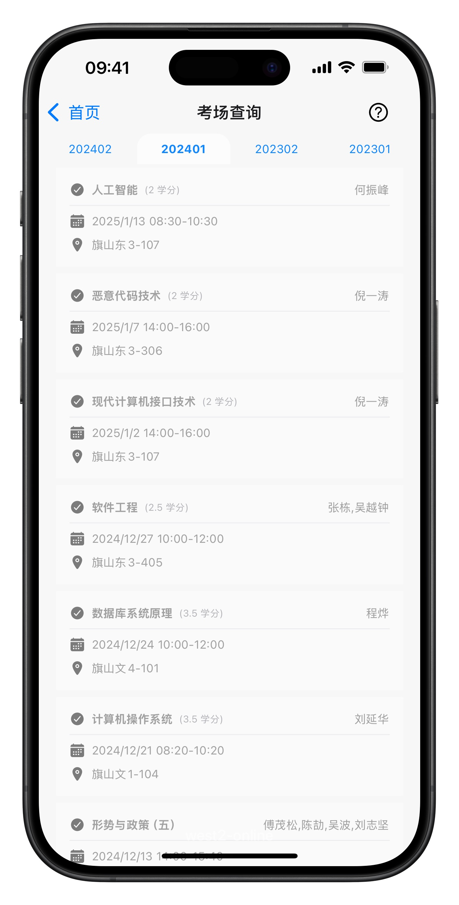

> 警告：本项目受福州大学统一指导，由福州大学计算机与大数据学院、福州大学网络安全与信息化办公室管理（以上单位合称“官方”）。本源代码使用宽松开源协议，但仅供学习参考，不允许直接或间接性使用/修改后使用在任何非官方和 west2-online 外的应用、网站、App 及任何可以与用户产生交互的互联网信息媒介中。本警告具备行政约束效力。

<div align="center">
  <h1 style="display: inline-block; vertical-align: middle;">fzuhelper-app</h1>
</div>

<div align="center">
  <a href="#overview">English</a> | <a href="docs/README.zh.md">中文</a>
</div>

## 概述

fzuhelper-app 是一个使用 React Native 跨端技术开发的客户端应用，每天为福州大学约 2 万至 3 万名学生提供服务。([fzuhelper 数据来源与介绍](https://west2-online.feishu.cn/wiki/RG3UwWGqPig8lHk0mYsccKWRnrd))。

> fzuhelper 于 2015 年上线，由 west2-online 从零开始开发并持续运营，尽可能为校内学生提供工业级实践，同时为学生就业提供有力支持。

<details>
<summary><b>App 预览图 [click to expand]</b></summary>
<div style="display: flex; overflow-x: auto;">
  
  
  
  
  
  
  
  
</div>
</details>

## 快速开始

本项目基于 [Node.js](https://nodejs.org/) 和 [Yarn](https://yarnpkg.com/)，请确保首先安装这些软件。推荐使用 nvm 来管理 Node.js 版本。本项目支持在 Node.js v22 下运行。

### iOS

> 您至少需要一台 **安装了 macOS 的电脑**。推荐配置：2021 年或之后的 MacBook Pro，32G 内存，配备 M1/M2/M3/M4 Pro/Max/Ultra 芯片。

在开始之前，请确保已安装最新版本的 [App Store 版 Xcode](https://apps.apple.com/us/app/xcode/id497799835) 和 [CocoaPods](https://cocoapods.org/)。

在终端中（推荐使用 iTerm2）按照以下步骤操作：

```bash
# 安装 Xcode 命令行工具
xcode-select --install

# 克隆仓库
git clone https://github.com/west2-online/fzuhelper-app

# 安装依赖包
yarn install

# 预构建 iOS 工程项目
yarn prebuild:ios --clean

# 在模拟器中运行开发版本
yarn ios

# （可选）如果需要在真机上运行
yarn ios --device
```

**注意：除非需要进行原生相关开发，否则不需要打开 Xcode 进行开发**，对于业务实现，可以全程在 vscode 中完成开发。

### Android

> 至少需要一台 **安装了 Windows 10 的电脑**。推荐配置：Windows 11 Pro，Intel 第 13 代或之后的 i5 标准电压或桌面处理器，32G 内存。

在开始之前，请确保已安装或创建以下内容：

1. [Android Studio](https://developer.android.com/studio) 和 Android SDK（版本 35 或以上，可以通过 Android Studio 安装）
2. [NDK（版本 28 或以上）](https://developer.android.com/studio/projects/install-ndk)
3. [OpenJDK（版本 17 或以上，使用 winget 安装，Microsoft.OpenJDK.17）](https://learn.microsoft.com/en-us/java/openjdk/install)
4. 一个 Android Studio 模拟器，可以参考 [Expo 文档](https://docs.expo.dev/get-started/set-up-your-environment/?platform=android&device=simulated) 中的说明进行设置。

为了方便，您可以设置环境变量 `APP_VARIANT=development`。

这将使用与发布版本不同的应用标识符，从而允许开发版和发布版共存。如果未设置环境变量或设置了其他值，则仅使用应用的发布版本标识符。

安装完所需软件后，就可以开始开发应用。

克隆仓库并安装依赖：

```bash
git clone https://github.com/renbaoshuo/fzuhelper-app.git
cd fzuhelper-app
yarn install
```

启动应用：

```bash
yarn start
```

在输出中，您可以找到以下选项以打开应用：

- [开发版本](https://docs.expo.dev/develop/development-builds/introduction/)
- [Android 模拟器](https://docs.expo.dev/workflow/android-studio-emulator/)

## 贡献者


如果您有兴趣加入 fzuhelper-app 的维护工作，请通过我们的 [官网](https://site.west2.online) 联系我们。
