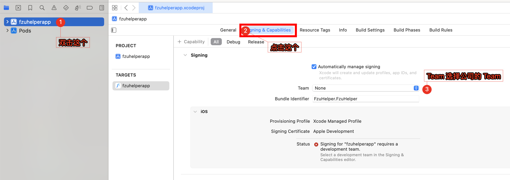
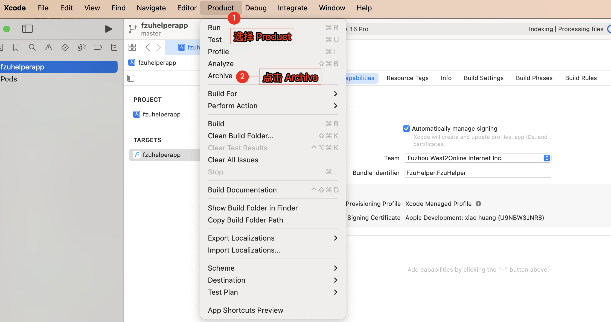
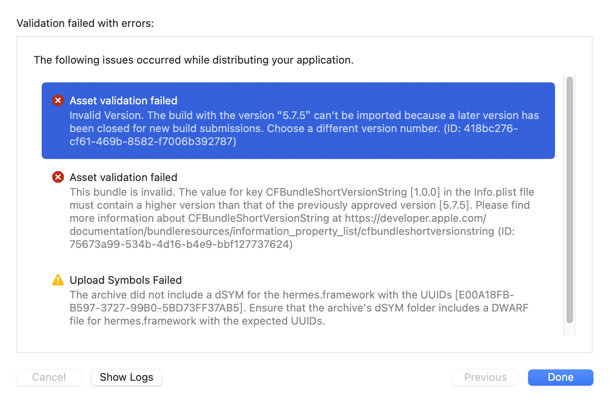
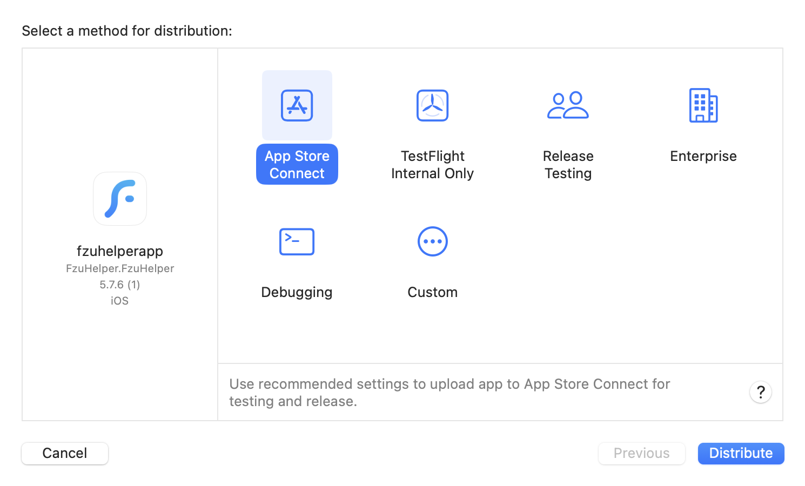

# iOS 应用程序构建指南

## 预先准备

1. 一台搭载新版 macOS 的电脑
2. 电脑上安装过 CocoaPods 以及 Xcode

CocoaPods安装很简单，`brew install cocoapods` 即可，[brew](https://brew.sh/) 是 macOS 下的包管理工具，他们官网提供了一键安装脚本

```bash
/bin/bash -c "$(curl -fsSL https://raw.githubusercontent.com/Homebrew/install/HEAD/install.sh)"
```

## 总步骤

1. 进行预构建（prebuild）构建出我们的 iOS 项目
2. 进入这个项目目录，进行依赖安装（pod install）
3. 通过 Xcode 打开这个项目，进行 Archive、Validate 以及 Publish

## 预构建

在项目根目录中执行

```bash
yarn prebuild:ios
```

这会开始执行预构建流程，下面是几个要点

### Bundle identifier

iOS bundle identifier 必须是 `FzuHelper.FzuHelper`，套装 id（即 bundle identifier）是在程序第一次上架时就锁死的，要继续发布必须使用相同的 id，目前已经在 `app.json` 中配置好了。

会提示 `The app 福uu by Fuzhou West2Online Internet Inc. is already using FzuHelper.FzuHelper`，这是正常的，不用管。

### Installing CocoaPods...

嗯，第一次 prebuild 时就会很久，我本机在 surge + nexitally 的情况下也跑了好几分钟，印象里目前机场没有比奶昔更好（更贵）的机场，应该只会更久而不会更短

当然，也许你电脑性能很好，网络很顺畅，安装的很快呢，说不定

## 依赖安装

预构建结束后我们需要安装对应的 pods，这个实际上就是依赖（Dependency）

在你的项目根目录执行

```bash
npx pod-install
```

或者你进入预构建项目目录，执行`pod install`也是一样的，这里有一个你可能会注意到的地方


pod 安装是并发的，网络流量走的很快，不必在意

## 通过 Xcode 构建并推送

打开 xcode，在 xcode 中打开这个目录（应该是 `ios` 目录），不必进行调试，调试是调不通的（往往会提示`No bundle URL present`），但是打包是可以的

### 修改签名

公司的签名应该是`Fuzhou West2Online Internet Inc.`，如果没有出现这个，也许是因为你**没有在 Xcode 中登录你的 AppleID**，或者**你没有受邀加入公司的团队**



### Archive



此时 Xcode 会帮助你做好剩余的构建工作，构建后会提示`Build Successful`，然后会跳出 Archives 窗口

> 构建蛮花时间的，不过是值得的。如果你没有找到 Archives 在哪，你可以前置全部的 Xcode 窗口，Xcode 新窗口很可能出现在另一个屏幕（我也不知道为什么）


你需要先`Validate App`，在新窗口中选择`Validate`即可，不需要客制化（`custom`）

### Validate 中可能出现的情况



这是三个常见的问题

#### Invalid Version

按照它的说明，`5.7.5`这个版本已经被使用了，我们需要使用更高的版本，这个往往出现在你错误的选择了版本号，你应该选择`5.7.6`

#### This bundle is invalid

检查你的`app.json`文件，里面的`version`应该要更高，我这里出现问题是因为我的`app.json`内的版本设置为`1.0.0`，需要设置为标准的版本号

#### Upload Symbols Failed

这只是个警告，iOS 场景下可以认为 `warning = no sense`，Apple 的检查过于严苛，忽略即可

### 常见问题

#### 当 Build/Validate 失败时需要删掉构建的文件夹吗？

不需要，修改后重新执行预构建和依赖安装即可，它会复用可以复用的东西

#### 需要在 Xcode 中修改应用版本号吗？

不用，在`app.json`中修改即可

#### 我可以在Xcode 中调试/修改代码吗？

不行，调试会提示缺少 js bundle，修改代码可能和 Expo 预期产物不符

### Distribute App



选择发布到 App Store Connect 即可，后续可以在 [App Store Connect](https://appstoreconnect.apple.com/) 上操作

## 修改构建版本号

修改 `app.json` 中的 `expo.ios.buildNumber` 字段，每次将 patch 递增 1 即可。

这个版本号并不是显示的版本号，是用来让系统识别构建版本的。

## 如果你是 west2-online 的开发者

1. 联系学长，将你加入我们的 Develop Team
2. 发布时最好先在 App Store Connect 中添加新版本，填写好信息后再在 Xcode 中推送到平台上
3. Apple Review 时间大约需要 1-2 个工作日
