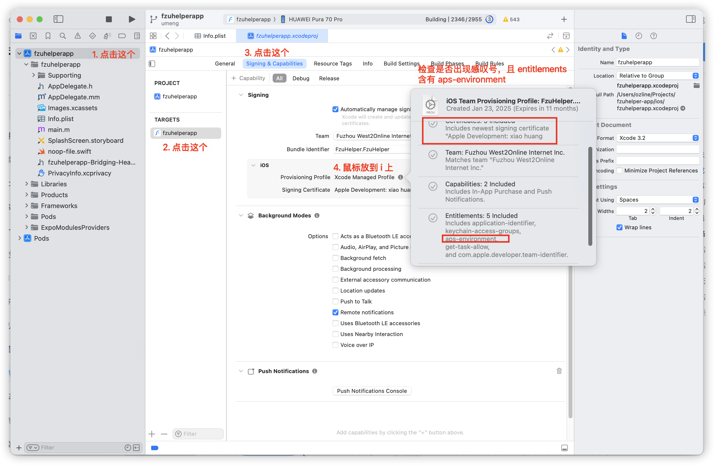

# 常见问题排查

## iOS

### 无法打开 iOS Simulator

关键词: xcrun simctl boot {id} exited with non-zero code:2
关键词: No such file or directory

> Opening on iOS...
> Error: xcrun simctl boot 9CEBE3B2-E677-4C8D-91C1-7463A13C83A1 exited with non-zero code: 2
> An error was encountered processing the command (domain=NSPOSIXErrorDomain, code=2):
> Unable to boot device because we cannot determine the runtime bundle.
> No such file or directory

打开一次`Simulator`这个程序，它会做一些初始化工作，打开后再运行就发现正常了

出现这个问题一般是版本更新导致的，而且看起来是 Apple 工程师的问题

### 如果你认为你的代码没有问题，但持续编译报错

删除本地的构建文件夹（如`ios`或`android`），重新执行预构建-安装依赖-运行

这个问题通常不会发生很多次，通常是和底层（指的是原生系统）做交互开发时会涉及

## 友盟推送在 iOS 侧下的常见问题

### 1. 没有应用程序授权

关键词：no valid aps-environment entitlement found for application

按照下图检查即可，通常是证书链和描述文件有问题，如果有问题，可以尝试按照下列步骤刷新：

1.[友盟官方文档](https://developer.umeng.com/docs/67966/detail/66748)

2.[Apple Developer Resources](https://developer.apple.com/account/resources/)

第一个友盟官方文档是手把手教你怎么创建所有的文件，但现在已经通常由 Xcode Cloud 接管证书签名了，你只需要负责生成即可

同时需要注意，也许你由多个相同功能且名字一致的证书（比如同样是自己的 2 份开发者证书），可能造成证书误用，建议直接全部删除然后从头开始

> 对于其他老旧 iOS 文档也一样，由于 Apple 激进的更迭策略，很多老的东西已经没那么麻烦了，而且

### 2. BadDeviceToken

关键词：BadDeviceToken、注册成功但在后台无法查询到设备

参考[这份友盟论坛回答](https://community.umeng.com/topic/view/675ff3b2cac72919a7a60083)，可以知道

1. 上架AppStore和ADHoc打包，为生产环境，只能发送正式消息，测试消息发送会返回BadDeviveToken。

2. 其他打包方式或Debug模式，为开发环境，只能发送测试消息，必须添加测试设备，如发送正式消息，会返回BadDeviveToken。
